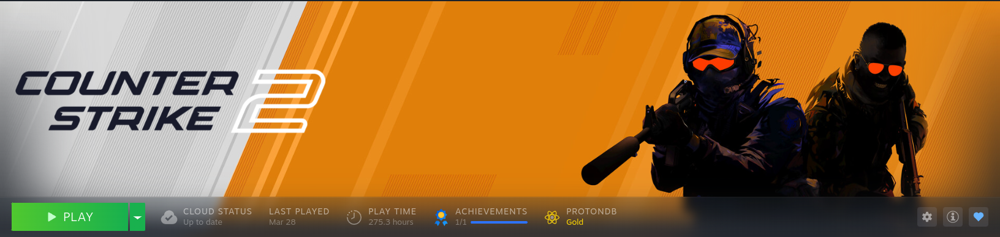

# ProtonDB Status

Show ProtonDB compatibility directly in the game details stats row (next to Play Time / Achievements) in Steam Desktop mode.



## Features

- Shows ProtonDB tier (Platinum/Gold/Silver/Bronze/Borked)
- Badge appears only when a valid ProtonDB rating exists
- Click badge to open the game ProtonDB page
- Lua backend proxy avoids frontend CORS issues

## Requirements

- Millennium installed
- Steam desktop client

## Install (Marketplace)

If this plugin is available on the SteamBrew plugin marketplace, install it from:

- https://steambrew.app/plugins

## Install (Local from this repository)

1. Clone this repository.
2. Build the frontend:

```bash
npm install
npm run build
```

3. Symlink the repository into your Millennium plugins folder:

```bash
mkdir -p ~/.local/share/millennium/plugins
ln -sfn "$(pwd)" ~/.local/share/millennium/plugins/protondb-status
```

Windows path:

```text
%MILLENNIUM_PATH%\plugins\protondb-status
```

4. Restart Steam, then enable the plugin from Millennium plugins settings.

## Install (Local from zip release)

1. Download the latest release.
2. Extract it into your Millennium plugins directory so this path exists:

Linux path:

```bash
~/.local/share/millennium/plugins/protondb-status
```

Windows path:

```text
%MILLENNIUM_PATH%\plugins\protondb-status
```

3. Restart Steam, then enable the plugin from Millennium plugins settings.

Notes:

- The zip is prebuilt and includes `.millennium`, so users do not need Node.js/npm.
- If you extract and end up with a nested folder like `protondb-status/protondb-status`, move the inner folder up one level.

## Releases

This repo includes a GitHub Actions workflow that:

- installs dependencies
- builds the plugin
- packages a local-install zip with the correct folder layout
- uploads the zip to GitHub Releases when you push a tag like `v1.0.1`

Tag and push example:

```bash
git tag v1.0.1
git push origin v1.0.1
```

## Notes

- Frontend changes usually apply after rebuild/reload.
- Backend Lua changes may require a full Steam restart.
- Make sure your screenshot exists at `images/screenshot.png` for README rendering on steambrew.app.
